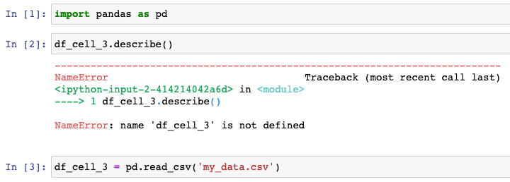
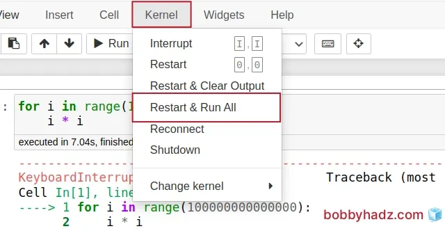

**The notebook file (`.ipynb`) is all you need**.

Select the project that is most interesting to you:

- Maybe you like how much details and effort you put into it.
- Maybe you like the insights you came into conclusions for that problem.
- Maybe you like the flow and clarity of the analysis you've done.

## Tips

- Start from the goal. Specify whether we are doing EDA or CDA? Break it down into sub-questions. Outline the analysis steps in order.
- Show graphs & statistical numbers, along with your interpretations (what they mean)
    - Does it confirm or go against your initial assumption?
    - Can you explain the outliers? (if any)
- Make use of the principle of "small multiples" available in seaborn (when applicable)
    - Univariate comparisons
    - Bivariate relationships

## Organizing your Notebook

**Clearly define the objective at the start**: Before you even begin coding, outline what you aim to achieve with the Notebook. A clear objective sets the stage for focused analyses and helps your audience quickly understand the Notebook’s purpose. 

**Limit tangential analyses**: You may encounter exciting side routes as you dive into your data. While it’s tempting to go off on tangents, these can dilute the primary focus of your Notebook. If a tangential analysis starts to take on a life of its own, it may warrant a separate notebook. 

### 1. Title and Project Overview (required)

This should occupy the first markdown cell:

- clearly stating the notebook’s purpose, objectives, and scope.
- a concise explanation of what the notebook accomplishes and why it exists.

### Table of Contents

If viewer already has it (on the side), no need to make another one.

### 2. Setup Code (required)

Group all of these at the top cell:

1. all imports
2. configuration parameters
3. constants

A well-organized setup section looks like this:

```py
# Standard libraries
from pathlib import Path

# Installed libraries
import pandas as pd
import numpy as np
import matplotlib.pyplot as plt
import seaborn as sns

# Configuration
pd.set_option('display.max_columns', None)
plt.style.use('seaborn-v0_8-darkgrid')
np.random.seed(42)

# Paths
DATA_PATH = Path('../data/raw/')
OUTPUT_PATH = Path('../output/')
```

**Why**?

- Easy modification of configurations without hunting through the notebook
- Anyone opening your notebook can immediately see what packages are needed
- When you turn your notebook into a production script, it's much easier to create a requirements list

### 3. Data Loading & Quick Validation (required)

Load datasets here and perform immediate validation checks:

- datasets shapes
- column names
- data types
- first few rows

**Why**? This validation step catches loading errors immediately rather than discovering problems deep into analysis when datasets don’t match expectations.

### Summary & Next Steps (required)

Last section where you list key findings, insights and future work in English. Should highlight and conclude, not to be detailed or comprehensive.

## Markdown

A good Notebook uses the **markdown cells** effectively to describe what each code cell is doing. It’s not just the code that speaks; the text around it elucidates why a particular analysis is essential, what the results signify, or why a specific coding approach was taken. 

**Charts**, graphs, and other visual aids should not just be addressed as afterthoughts. Instead, they should be integral parts of the narrative, aiding in understanding the data and the points you are trying to convey. 

**Your Notebook is the story**—the narrative explaining your data-driven insights. 

### Sections

- **Section Headers** with clear hierarchy to organize content into digestible chunks.
- Maintain consistent header levels throughout—don’t jump from H1 directly to H3, as this disrupts logical flow.

```md
# Major Section (Data Cleaning)
## Subsection (Handling Missing Values)
### Specific Topic (Imputation Strategy)
```

### Before Code Cells: Explanatory Commentary

They should describe what the subsequent code accomplishes and why you’re doing it. Don’t simply restate what the code does—explain the reasoning and context. Compare these approaches:

**Bad:**

```md
Calculate mean values
```

**Good:**

```md
## Baseline Statistics

Calculate mean values for numerical features to establish baselines before transformation.
These baselines will help us assess whether our scaling and normalization procedures maintain expected distributions.
```

The good version explains both what and why, providing context that helps readers understand your methodology.

#### Inline Code Documentation

Reference specific variables, functions, or parameters using **backticks**. Example:

```md
The `train_test_split()` function divides our dataset using an 80/20 ratio defined by `test_size=0.2`.
```

This visual distinction helps readers track technical elements within prose.

### After Output Cells: Findings and Interpretations

Transform raw results into insights. After displaying dataframes, visualizations, or statistical summaries, add markdown cells interpreting what you observe. For example, after generating a correlation heatmap:

```md
### Key Correlations Observed

The heatmap reveals several important patterns:

- Strong positive correlation (0.87) between feature_A and feature_B suggests potential multicollinearity requiring attention during feature selection
- Surprising negative correlation (-0.42) between feature_C and target variable contradicts domain expert expectations, warranting further investigation
- Features D, E, and F show minimal correlation with the target, making them candidates for removal
```

This interpretation adds value beyond the visualization itself, highlighting specific insights and implications for subsequent analysis steps.

## Code Cells

### Organizing Code Within Cells

**Rule of thumb**: if a cell exceeds 20-30 lines or requires extensive scrolling, consider breaking it into multiple cells with intermediate outputs displayed.

For example, rather than one massive cell loading data, cleaning it, engineering features, and training a model, separate these into distinct cells:

```py
# Cell 1: Load data
df = pd.read_csv(DATA_PATH + 'customers.csv')
print(f"Loaded {len(df)} records")
df.head()
```

Then:

```py
# Cell 2: Handle missing values
df['age'].fillna(df['age'].median(), inplace=True)
df['income'].fillna(df['income'].mean(), inplace=True)
print(f"Missing values after imputation:\n{df.isnull().sum()}")
```

This separation allows: running each step independently, examining intermediate results, and **debugging specific operations without rerunning everything**.

### Define Functions

When you find yourself copying similar code blocks, extract the logic into functions defined early in the notebook:

```py
def calculate_customer_lifetime_value(df, revenue_col, tenure_col):
    """
    Calculate CLV as average monthly revenue multiplied by tenure.
    
    Parameters:
    df: DataFrame containing customer data
    revenue_col: Column name containing monthly revenue
    tenure_col: Column name containing tenure in months
    
    Returns:
    Series containing CLV for each customer
    """
    return df[revenue_col] * df[tenure_col]
```

Note: the **docstring** must explain parameters, return values, and any important assumptions. For details, checkout the following two links:

- [Google guide](https://google.github.io/styleguide/pyguide.html#38-comments-and-docstrings)
- [Numpy standard](https://numpydoc.readthedocs.io/en/latest/format.html#docstring-standard)

## Version Control

### Meaningful Commit Messages

Instead of “updated notebook,” write “added feature engineering for categorical variables” or “implemented cross-validation for hyperparameter tuning.” 

These descriptive messages help others (and future you) understand notebook evolution.

### Notebook Naming

This simple practice prevents confusion when multiple notebook versions exist:

- **Date**: `sales_forecasting_2024-01-15.ipynb`
- **Version**: `customer_churn_analysis_v2.ipynb`
- **Sequence** (split "huge" notebooks):
    - `01_data_exploration.ipynb`
    - `02_data_cleaning.ipynb`
    - `03_feature_engineering.ipynb`

## Before you submit (REQUIRED)

### Check for errors caused by out-of-order cells

When you work in a notebook, you might jump around—adding code to later cells, then going back and running earlier cells. This can create problems.

**Example problem:**  
You create a DataFrame in Cell 3, but then run Cell 2 first. Cell 2 tries to use that DataFrame before it exists, and you get an error.



Common issues revealed by this test include:

- Variables defined in later cells but **used earlier**
- Cells that modify shared dataframes assuming specific **prior operations**
- Random operations producing different results due to **seed placement**
- **Import statements** scattered throughout instead of grouped at the top

**Solution:**  
The Restart and Run All Test serves as your primary reproducibility check. Regularly restart your kernel and execute all cells from top to bottom (`Kernel → Restart & Run All`). 



**Quick check:**  
After running top to bottom, the numbers in the brackets next to each cell should be in order (1, 2, 3...). Sequential numbers mean your notebook is clean, reliable, and easy for others to trust.

# Managing Multi-Notebook Projects

Complex data science projects often require multiple notebooks covering different aspects of analysis.

**Project Directory Structure** should separate notebooks by purpose and logical workflow stages. A well-organized project structure looks like:

```text
project_name/
├── data/
│   ├── raw/              # Original, immutable data
│   ├── processed/        # Cleaned, transformed data
│   └── external/         # External data sources
├── notebooks/
│   ├── 01_data_exploration.ipynb
│   ├── 02_data_cleaning.ipynb
│   ├── 03_feature_engineering.ipynb
│   ├── 04_model_training.ipynb
│   └── 05_model_evaluation.ipynb
├── src/                  # Reusable Python modules
│   ├── data_processing.py
│   ├── feature_engineering.py
│   └── modeling.py
├── outputs/
│   ├── figures/
│   ├── models/
│   └── reports/
├── uv.lock
├── .python-version
├── .gitignore
└── pyproject.toml
```

**Numbered Notebook Prefixes** indicate execution order and workflow stages. The numerical prefix (`01_`, `02_`, etc.) immediately communicates which notebooks to run first and their relationships within the overall analysis pipeline.

**Shared Code in Python Modules** extracts commonly used functions from notebooks into importable Python files in a `src/` directory. As notebooks mature and patterns emerge, moving stable, reused code into modules reduces duplication and improves maintainability. Import these modules at the top of notebooks:

```py
import sys
sys.path.append('../src')    # Necessary for subsequent local imports to work

from data_processing import clean_dataset, handle_missing_values
from feature_engineering import create_interaction_features, encode_categoricals
```

Note the: `sys.path.append('../src')` statement is what makes the subsequent imports possible. So it is necessary to have it in this order.

# Extra (optional)

## Annotate every aspect of your plots

Plots should have annotations everywhere. The goal is to make sure our plots are fully descriptive. In other words, they should be stand-alone, "readily interpreted".

For each visualization provided within the notebook, we have to ensure that they contain **at least** the following:

- Labels on the x-axis and y-axis, with text that properly describes the data, instead of using variable names.
- A title explaining what is depicted.
- A legend, if necessary.
- Units for each axis, e.g., "Temperature (Celsius)" on the y-axis label.

For a nice tutorial on annotating plots using python, I recommend the [Matplotlib tutorial](https://github.com/rougier/matplotlib-tutorial).
