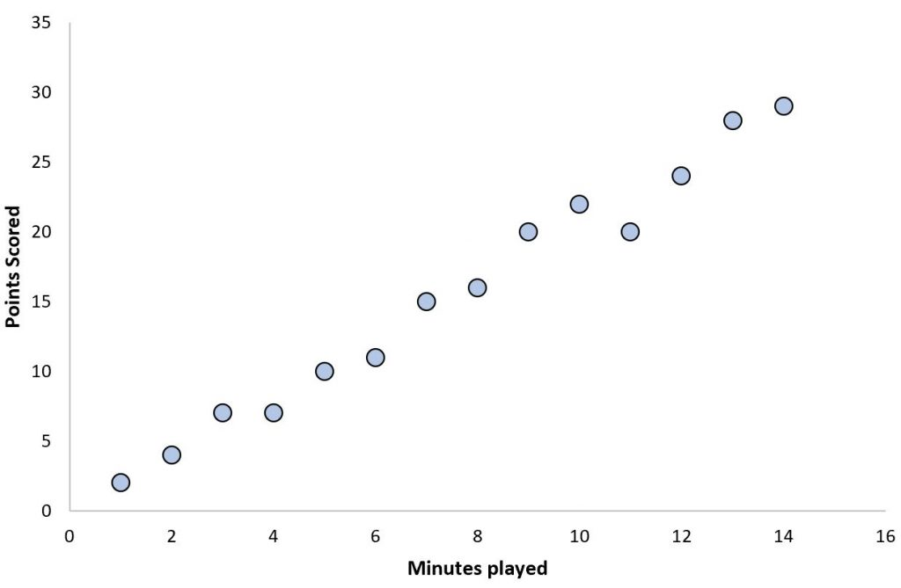
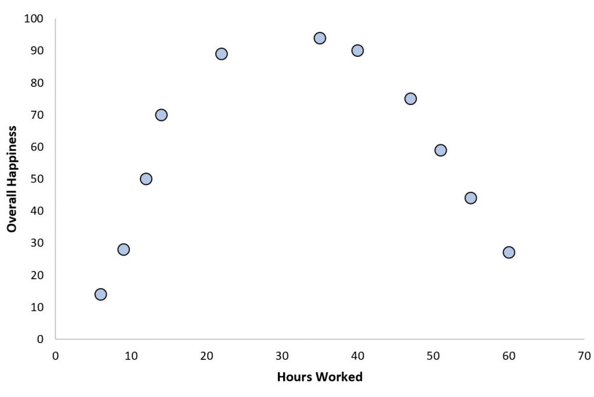
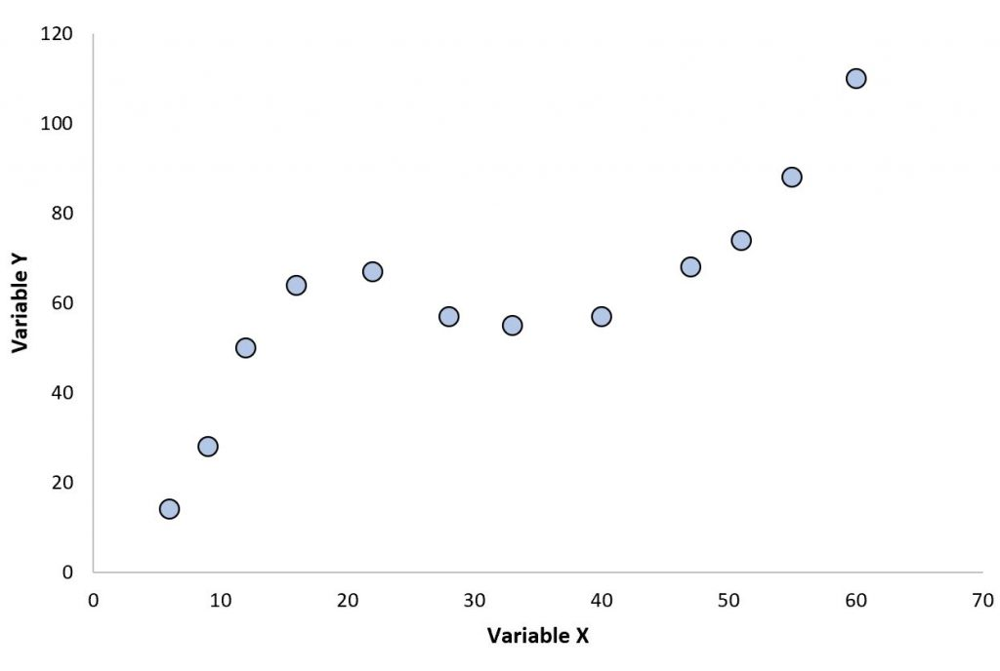
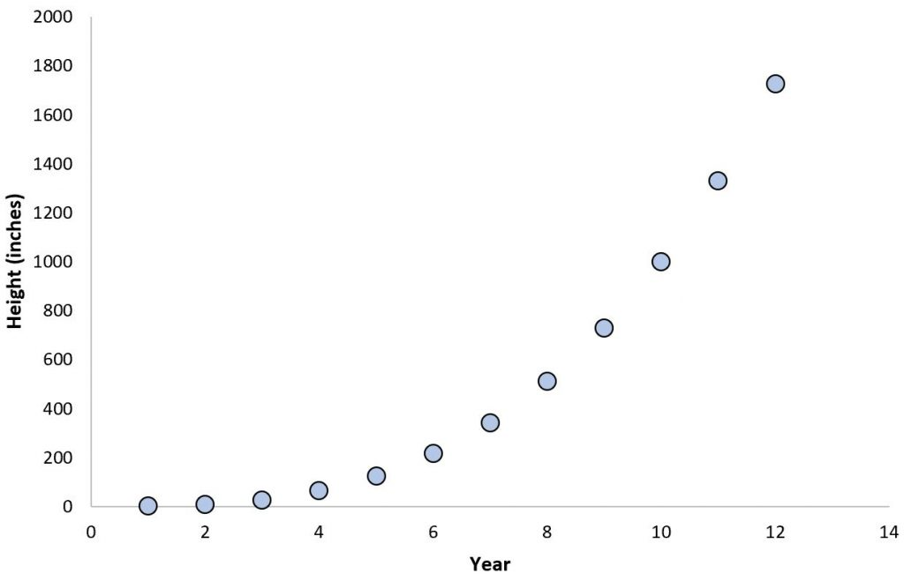
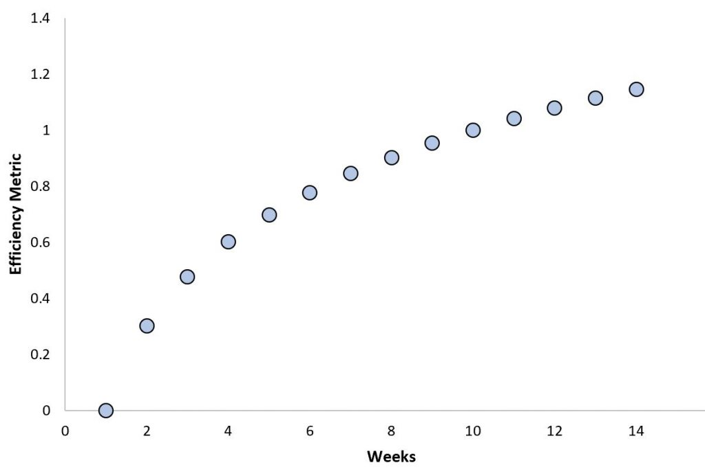

## Learning Objectives

In this lecture we learn to:

1. Distinguish between linear and non-linear relationships.
2. Fit non-linear patterns using non-linear models.
3. Fit non-linear patterns using linear models with `PolynomialFeatures`.
4. Fit non-linear patterns using linear models with `SplineTransformer`.
5. Recognize Decision Trees and Support Vector Machines as non-linear models.

:::: {.notes}
The theme: even when the data shows curved patterns, we can still leverage linear models by engineering non-linear features, and we can also turn to inherently non-linear models.
::::


# Non-linaer relationships

- A **non-linear relationship** occurs when the change in the dependent variable ($y$) is not strictly proportional (directly or inversely) to the change in the independent variable ($x$).
- Graphically, this forms a curve rather than a straight line.
- In a linear relationship, the derivative (the slope) is constant. In a non-linear relationship, the slope changes at every point.
  - **Linear Equation:** $y = mx + b$ (constant slope $m$).
  - **Non-linear Equation:** May include exponents, logarithms, or trigonometric functions, such as:
      - Quadratic: $y = ax^2 + bx + c$
      - Exponential: $y = ab^x$


## 1. Linear: Game Time vs Points Scored

One example of this might be minutes played in a basketball game vs. total points scored:

{fig-align="center" .r-stretch}


## 2. Quadratic

This typically forms a **U-shape** or inverted U-shape. A common example is **weekly work hours vs. productivity**: productivity increases up to a certain point, then drops due to fatigue.

{fig-align="center" .r-stretch}

Other examples:

- **Kinetic Energy:** Energy scales with the square of the velocity ($E = \frac{1}{2}mv^2$).
- **Square Area:** Area scales quadratically ($A = s^2$).
- **Circle Area:** Follows a quadratic relation ($A = \pi r^2$).

## 3. Cubic

Characterized by an **S-shape** with two distinct inflection curves. This pattern frequently appears in:

{fig-align="center" .r-stretch}

Examples:

- **Balloon Volume:** The relationship between a sphere's volume and its radius is cubic ($V = \frac{4}{3}\pi r^3$).
- **Thermodynamics:** Commonly maps physical variables within this field.


## 4. Exponential

Here, the dependent variable grows at an accelerating rate. Clear examples include **population growth** or the **rapid burst of bamboo growth** following an initial slow phase.

{fig-align="center" .r-stretch}


## 5. Logarithmic

This features rapid initial growth that heavily slows over time or with increased inputs, illustrating the principle of **diminishing returns**.

{fig-align="center" .r-stretch}

- Example: In physics, the human ear's response to sound intensity is logarithmic. Doubling the acoustic energy only produces a slight perceived increase in volume, rather than feeling twice as loud.


## A synthetic non-linear dataset

:::: {.columns}

::: {.column width="60%"}
- We generate a **1D input feature** and a **non-linear target**:
  - Target is roughly a **cubic polynomial** in the input.
  - We add some **random noise** to make it realistic.
- We store the data in a pandas DataFrame with:
  - `input_feature`
  - `target`
- Scatter plot of `input_feature` vs `target` shows:
  - A **curved** trend, not a straight line.
  - Local regions where the slope changes sign.
:::

::: {.column width="40%"}

:::

::::

:::: {.notes}
This controlled setup lets us know the ground-truth relationship (cubic) while still having randomness. It’s ideal for illustrating underfitting and improved models.

Encourage students to inspect the shape: a straight line will clearly miss some structure. This motivates feature engineering or non-linear models.
::::


## Plain LinearRegression underfits

:::: {.columns}

::: {.column width="60%"}
- If we fit a standard `LinearRegression` on this data:
  - The model learns a **single straight line**.
  - The line will miss the **cubic curvature**.
  - Error (e.g. MSE) remains relatively **high**.
:::

::: {.column width="40%"}

:::

::::

:::: {.notes}
Connect to the notion of **underfitting**: the model is too simple to capture the structure, even with perfect training. More data alone won’t fix a fundamentally mismatched model.
::::


## Non-linear feature engineering

- Another strategy: **keep the model linear**, but **transform the features**.
  - `PolynomialFeatures(degree=3)`: $( x^1, x^2, x^3, \dots )$
  - `SplineTransformer(n_knots=5)`: split into ranges and create separate regressions

:::: {.notes}
Emphasize that a linear model on non-linear features can approximate curved functions. The model is still linear in the **parameters**, but non-linear in the **original input**.
::::


## PolynomialFeatures

- We use `PolynomialFeatures` to build powers of the input:

```python
from sklearn.preprocessing import PolynomialFeatures
from sklearn.linear_model import LinearRegression

poly = PolynomialFeatures(degree=3, include_bias=False)
X_poly = poly.fit_transform(data)  # data is 2D: (n_samples, 1)

reg = LinearRegression()
reg.fit(X_poly, target)
```

- The model can now fit **cubic-like curves**.

:::: {.notes}
Connect degree 3 explicitly to the underlying cubic relationship in the synthetic data. Point out that higher degrees give more flexibility but increase the risk of overfitting.
::::


## Visual effect of polynomial features

:::: {.columns}

::: {.column width="60%"}
- After transformation, the linear model’s prediction:
  - Curves to follow the data trend.
  - Achieves **lower MSE** than the plain line.
- We can compare fits for different degrees (e.g. 1, 3, 10):
  - Degree 1: underfitting.
  - Moderate degree: good fit.
  - Very high degree: risk of **overfitting** (wiggly curve).
:::

::: {.column width="40%"}

:::

::::

:::: {.notes}
Use side-by-side plots (or a sweep over degrees) to visually show underfitting vs overfitting. Reinforce the bias–variance trade-off.
::::


## Splines: localized flexibility


:::: {.columns}

::: {.column width="60%"}
- `SplineTransformer` builds **piecewise polynomial** features:
  - The feature space is split into regions (“knots”).
  - In each region, we fit a low-degree polynomial.
  - The pieces are joined **smoothly** at the knots.

```python
from sklearn.preprocessing import SplineTransformer
from sklearn.pipeline import make_pipeline
from sklearn.linear_model import LinearRegression

model = make_pipeline(
    SplineTransformer(n_knots=..., degree=3),
    LinearRegression(),
)
model.fit(data, target)
```

:::

::: {.column width="40%"}

:::

::::


:::: {.notes}
Explain that splines give more local control than a single global polynomial. We can capture curves that bend differently in different parts of the input range.
::::


## Comparing polynomial and spline approaches

:::: {.columns}

::: {.column width="60%"}
- **PolynomialFeatures:**
  - Global polynomial; behavior at one end affects the whole curve.
  - Simpler to understand, but can behave wildly outside the data range.
- **SplineTransformer:**
  - Local control; can adapt shape in different regions.
  - Often more stable and interpretable for complex curves.
:::

::: {.column width="40%"}

:::

::::

:::: {.notes}
Encourage students to see both as feature engineering tools. Choice depends on problem, data range, and how much local flexibility is needed.
::::

## Strategy 2: Non-linear models

:::: {.columns}

::: {.column width="60%"}
- One solution is to use **non-linear estimators** directly. Things like: Decision Trees, Random Forests, SVMs
- Decision Tree Regressors automatically split features and averages it's y values at that range
:::

::: {.column width="40%"}

:::

::::

:::: {.notes}
At this stage, keep the description high-level. The key idea is that some models are non-linear “by design” and can adapt flexibly to complex patterns.
::::


## Take-home messages

- Not all data is **linearly** related; curved patterns are common.
- We can address non-linearity in two main ways:
  - Use **non-linear models** (e.g., Decision Tree).
  - Use **non-linear feature engineering** (polynomials or splines) with linear models:
    - `PolynomialFeatures`: `degree`
    - `SplineTransformer`: `knots` and `degree`

:::: {.notes}
Close by tying back to linear models as a flexible building block: combined with the right features, they can handle surprisingly rich patterns while remaining relatively simple.
::::

