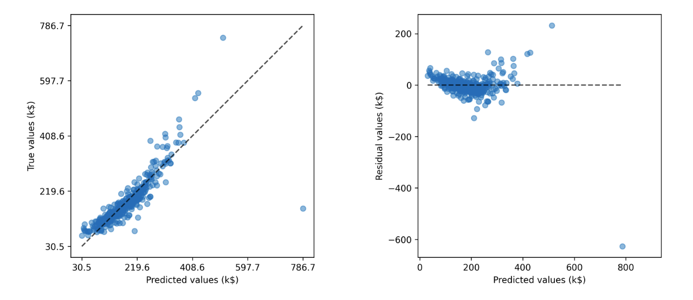
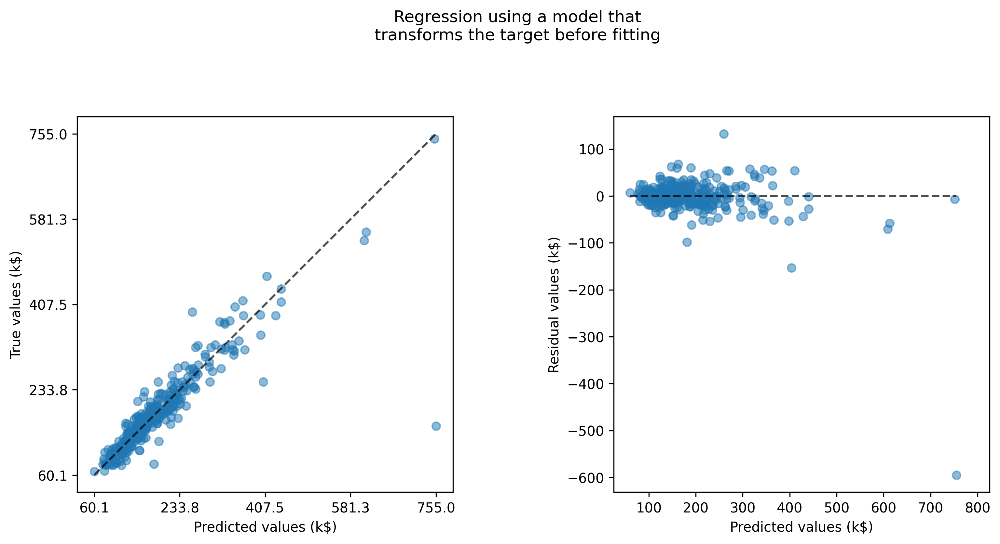

## Learning Objectives

In this lecture we learn to:

1. Explain why regression models need dedicated evaluation metrics.
2. Interpret and compare MSE, ($R^2$), MAE, median AE, and MAPE.
3. Diagnose regression models visually using prediction and residual plots.
4. Explain when a target transformation can improve model fit and metrics.

::::: {.notes}
The core theme is that numerical targets open up a richer family of metrics and visual diagnostics than accuracy alone. We also highlight how poor choices or naïve baselines can mislead us, and how transformations can unlock better behavior.
:::::

---

## Problem Setup

- We work with the **Ames housing** dataset.
- Goal: **predict house prices** in k$ (thousdands of dollars) from numerical features.
- As with classification, we:
  - Split into **train** and **test** sets.
  - Train on the train set.
  - Evaluate generalization on the test set.

::::: {.notes}
Re-anchor students: this is the same dataset family as in earlier lessons. Emphasize that the regression setting only changes the target type, not the overall train–test split logic.
:::::

---

## Optimization vs Evaluation

- Many regression models are trained by **minimizing a loss**:
  - Here: **mean squared error (MSE)** on the training set.
- Training objective:
  - Find coefficients that **minimize average squared error** on the train data.
- Evaluation:
  - We still care about **test performance**, not just training loss.

::::: {.notes}
Draw a clear line between the loss used for optimization and the metrics we report. Sometimes they match (MSE), sometimes we choose a different evaluation metric because it is more interpretable.
:::::

---

## Mean Absolute Error (MAE)

- **Definition**: average of absolute differences  
    $$ \text{MAE} =  \frac{1}{n} \sum_{i=1}^{n} \left| y_i - \hat{y}_i \right| \in [0, \infty)$$$
- Properties:
  - Same unit as the **target** (e.g., k$).
  - More robust than MSE to **large outliers**, but still mean-based.
- In the example:
  - MAE ≈ 22.6 k$ ⇒ on average, predictions are off by ~22.6 k$.

::::: {.notes}
Highlight why business stakeholders usually prefer MAE: it is easy to narrate as “average absolute dollar error.”
:::::

---

## Median Absolute Error

- **Definition**: median of absolute errors  
    $$ \text{Med AE} = \text{median}(\left| y_i - \hat{y}_i \right|) \in [0, \infty)$$
- Properties:
  - Even more robust to **outliers** than MAE.
  - Gives a sense of a **typical error** when a small fraction of cases are very bad.
- In the example:
  - Median AE ≈ 14.1 k$ ⇒ half of houses are predicted within ~14 k$.

::::: {.notes}
Encourage students to interpret MAE vs median AE together: if they are far apart, the error distribution is skewed with heavy tails.
:::::

---

## Mean Squared Error (MSE)

- **Definition**: average of squared differences between predictions and true values.  
    $$ \text{MSE} = \frac{1}{n} \sum_{i=1}^{n} (y_i - \hat{y}_i)^2  \in [0, \infty) $$
- Properties:
  - Penalizes **large errors more strongly** than small ones.
  - Has the **same scale as target squared**, making it hard to interpret.
- In the notebook:
  - We compute MSE on **train** and **test** sets for a linear regression model.

::::: {.notes}
Point out that “996.9” or “2064.7” are hard to interpret without context: students should feel the friction of squared units and lack of direct business meaning.
:::::

---

## $R^2$: Coefficient of Determination

- Rescales MSE by the **variance of the target**  
    $$ R^2 = 1 - \frac{\text{MSE}}{\sigma_{y}} \in (-\infty, 1]$$
- **Interpretation**:
  - Proportion of target variance **explained by the model**.
  - $R^2 = 1$: perfect predictions.
  - $R^2 = 0$: same as predicting the mean of the target.
  - $R^2 < 0$: worse than predicting the mean. (no limit to how worse!)

::::: {.notes}
Emphasize that $R^2$ supplies a dimensionless, relative notion of performance. Show that the default `score` for scikit-learn regressors is exactly this quantity.
:::::

---

## Baseline: Dummy Regressor

- We compare against a **DummyRegressor**:
  - Strategy: always predict the **mean** of the target on the train set.
- On the test set:
  - The dummy model achieves $R^2 \approx 0$.
  - Our linear regression should **beat** this baseline to be useful.

::::: {.notes}
Reinforce habit: always compare to a simple baseline. If a complex model cannot beat the “predict the mean” baseline, either the data is too noisy or the model is mis-specified.
:::::

---

## Limitations of $R^2$

- **Cannot be compared across datasets**:
  - Different target variances ⇒ different $R^2$ scales.
- Not expressed in **original units**:
  - Stakeholders cannot directly read errors in “k$” or other business units.
- We often need **more interpretable metrics** for communication.

::::: {.notes}
Encourage students to treat $R^2$ as a useful relative indicator, not an absolute measure of “goodness” that can be dragged between projects.
:::::

---

## Relative Error: MAPE

- **Mean Absolute Percentage Error (MAPE)** expressed as a percentage:  
  $$ \text{MAPE} = \frac{1}{n} \sum_{i=1}^{n} \left| \frac{y_i - \hat{y_i} }{ y_i } \right| \in [0, \infty] $$
- Example: MAPE of `12%` implies an average accuracy of `88%` in our predictions.

::: {.columns}
::: {.column}
#### The Good

You can compare model performance across different datasets. It allows you to say, "I’m 5% off on sales for a small store and 5% off for a giant warehouse," even though the dollar amounts are vastly different.

:::
::: {.column}
#### The Gotchas

- **Zero-division**: undefined or unstable when true values near zero.
- **Asymmetry**: penalizes over-predictions more than under-predictions.
:::
:::
<!-- end columns -->

::::: {.notes}
Connect to real-world KPIs: people often want “average % error” for revenue, demand, or sales forecasts, but students should remember the pitfalls around zeros and very small targets.
:::::

---

## Visual Diagnostics: Prediction & Residual Plots

{fig-align="center" .r-stretch}

::: {.columns}
::: {.column}
- Left: **True** values vs **predicted** values.
- Ideal: all points lie on the **diagonal**.
:::
::: {.column}
- Right: **Residuals** vs **predicted** values.
- Ideal: all points lie on the **zero-horizontal line**.
:::
:::
<!-- end columns -->

::::: {.notes}
Use these two plots to show that our first model still has structure in the residuals—the “banana/smile” shape. That visual pattern indicates systematic under- and over-estimation at different target ranges.
:::::

---

## Interpreting the First Residual Plots

- We see:
  - Under-estimation for both **low** and **high** priced houses.
  - Residuals show a **curved pattern** instead of random scatter.
- This suggests:
  - Model form may be **too simple** for the data.
  - A **transformation** of the target (or features) might help.

::::: {.notes}
Connect back to earlier lectures on non-linear relationships and transformations. Students should recognize the mismatch between model assumptions and data shape.
:::::

---

## Target Transformation: Idea

- Many real-world targets are **skewed** (e.g., prices, incomes).
- Strategy:
  - Apply a **monotonic transformation** to the target, fit the model there.
  - Transform predictions **back** to the original scale.
- Tooling:
  - `QuantileTransformer` + `TransformedTargetRegressor` in scikit-learn.

::::: {.notes}
Stress that we are not changing the underlying information—just reshaping the distribution so that the linear model’s assumptions are better aligned with the transformed problem.
:::::

---

## Visual Diagnostics After Target Transformation

- After transforming the target:
  - Predictions vs true values align better with the **diagonal**.
  - Residuals look more **symmetrically scattered** around zero.
- The **banana shape** is largely gone.

{fig-align="center" .r-stretch}

::::: {.notes}
Walk through both panels again and explicitly compare to the previous slide. Students should see a cleaner, more homogeneous cloud in the residual plot.
:::::

---

## Metric Comparison Before vs After

- After target transformation:
  - **$R^2$** improves.
  - **MAE**, **median AE**, and **MAPE** all improve.
- Interpretation:
  - The model is now **more accurate** in absolute and percentage terms.
  - Visual diagnostics and numerical metrics **tell a consistent story**.

::::: {.notes}
Summarize that good practice is to cross-check metrics with plots: both improved in tandem here, giving confidence in the transformation choice.
:::::

---

## Summary: Regression Metrics Toolkit

- **MSE / $R^2$**:
  - Useful for comparing models against the same dataset.
- **MAE / median AE**:
  - Interpretable in original units and robust to outliers.
- **MAPE**:
  - Business-friendly and useful across datasets.
- **Prediction and residual plots**:
  - Visual diagnostics that reveal patterns that metrics alone hide.
  - *Target transformation* shows a move from a banana shape to a more straight line shape

::::: {.notes}
Close by emphasizing that no single metric is universally best. The right choice depends on the domain, stakeholder needs, and model behavior, and should be backed by visual checks.
:::::

