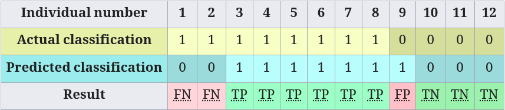

## Learning Objectives

In this lecture we learn to:

1. Distinguish classification metrics by how they trade off `FP` vs `FN`
2. Interpret performance from a confusion matrix
3. Compare classifiers using PR curves and ROC curves
4. Select the “best” classifier based on the metric that matches the use-case

::::: {.notes}
Focus on the mindset: metrics are the bridge between model predictions and the real-world costs of errors.
::::

---

## Why Metrics Matter

- If you can measure it, you can improve it.
- Metrics help capture a business goal into a quantitative target.
- Quantify progress over time:  
    baseline vs current vs perfect model.
- Different metrics imply different trade-offs, so they encode what you value.

---

## Accuracy as a Baseline

- **Accuracy** is the fraction of correct predictions.
- Accuracy can look good even when the model fails at the rare class.

{fig-align="center" .r-stretch}

::::: {.notes}
Use accuracy as a sanity check, not as the only decision rule.
::::

---

## How good is `74%`?

Let's compare against a `DummyClassifier`:

- DummyClassifier: `65.25%`
- LogisticRegression: `73.70%`
- Difference: `+8.4%`

Is accuracy a good metric for imbalanced data? No.

## Predicted vs Actual Classes

{fig-align="center" .r-stretch}

All possible outcomes:

- **Correct**:
  - **TP**: True Positives
  - **TN**: True Negatives
- **Incorrect**:
  - **FP**: False Positives
  - **FN**: False Negatives

## Point Metrics: Confusion Matrix

**Confusion Matrix** where only the diagonals are **Correct** (TP and TN).

{fig-align="center" .r-stretch}

---

## Confusion Matrix: Dummy Classifiers

{fig-align="center" .r-stretch}

---

## Point Metrics

- **Accuracy** is the proportion of all classifications that were correct, whether positive or negative:
    $$\frac{TP + TN}{\text{TP + TN + FP + FN}}$$  

. . . 

However, when the dataset is **imbalanced** or where one kind of mistake (FN or FP) is **more costly** than the other (which is the case in most real-world applications) it's better to optimize for one of the other metrics instead.

. . .

::: {.columns}
::: {.column}
**Precision** is the proportion of all the model's positive classifications that are actually positive:
    $$\frac{TP}{TP + FP}$$  
:::
::: {.column}
**Recall** is the proportion of all actual positives that were classified correctly as positives:
    $$\text{Recall} = \frac{TP}{TP + FN}$$
:::
:::
<!-- end columns -->

. . .

Precision and recall often show an inverse relationship:

- Precision improves as false positives decrease
- Recall improves when false negatives decrease

## Probability Near the Decision Boundary

:::: {.columns}
:::: {.column width="40%"}
- Logistic regression outputs probabilities (not hard labels) for each input.
- Near the decision boundary, probabilities are close to `0.5` (high uncertainty).
- Far from the boundary, probabilities are closer to `0` or `1` (more confident).
::::

:::: {.column width="60%"}

::::
::::

---

## Distance Near the Decision Boundary

:::: {.columns}
:::: {.column width="40%"}
- Signed distance from the decision boundary.
- Positive if on the positive side, negative if on the negative side.
- Zero means the point is exactly on the boundary.
::::

:::: {.column width="60%"}

::::
::::

---

## Thresholding after: Probability and Distance

- Models in `sklearn` can produce either: **Probability**, **Distance** or both.
- `model.predict(X)` is the final “gate”; it uses a **threshold** for the *Positive* class:
  - default `0.5` for probability
  - default `0.0` for distance
- A different threshold gives:
  - different predictions
  - different performance
  - different confusion matrix

## Interactive Demo

[**Interactive Demo**: Classifier Threshold effect on point and summary metrics](./widget_threshold.qmd){.center}

## Point Metrics Summary

The following metrics are commonly used to assess the performance of classification models:

| Metric | Formula | Interpretation |
| :--- | :--- | :--- |
| **Accuracy** | $\frac{TP + TN}{TP + TN + FP + FN}$ | Overall performance of model |
| **Precision** | $\frac{TP}{TP + FP}$ | How accurate the positive predictions are |
| **Recall or Sensitivity** | $\frac{TP}{TP + FN}$ | Coverage of actual positive sample |
| **Specificity** | $\frac{TN}{TN + FP}$ | Coverage of actual negative sample |
| **F1 score** | $\frac{2TP}{2TP + FP + FN}$ | Hybrid metric useful for unbalanced classes |

::::: {.notes}
Precision-recall trade-off is not an accident; it is controlled by the decision rule (threshold).
::::

## Summary Metrics: PR Curve

:::: {.columns}
:::: {.column width="40%"}
- When you vary the decision threshold, you get different `(precision, recall)` pairs.
- A **PR curve** plots this trade-off:
  - each point corresponds to a threshold
- **Average Precision (AP)** is the area under the PR curve.
::::

:::: {.column width="60%"}

::::
::::

## Summary Metrics: ROC Curve

:::: {.columns}
:::: {.column width="40%"}
- The **ROC curve** plots:
  - **Sensitivity / True Positive Rate (TPR)** vs
  - **False Positive Rate (FPR)** as the threshold varies.
- **ROC-AUC** summarizes the whole curve into one number.
::::

:::: {.column width="60%"}

::::
::::

## Comparing Classifiers

:::: {.columns}
:::: {.column width="40%"}
To choose the best model, align the metric with the use-case:

- If missing positives is very costly: emphasize **Recall** (or **PR curve** region with high recall)
  - If false alarms are very costly: emphasize **Precision**
  - If you want a balanced compromise: **F1** can be a starting point
  - Use curves to understand *how* performance changes when you move the threshold.
::::

:::: {.column width="60%"}

::::
::::

---

## Summary: Classification Metrics Toolkit

- **Accuracy**: a quick baseline, but risky for imbalance.
- **Confusion matrix**: separates `FP` vs `FN`.
- **Point metrics**: precision/recall/specificity/F1 from confusion matrix counts.
- **PR curves**: threshold trade-off focused on the positive class.
- **ROC curves**: threshold trade-off using TPR vs FPR.
- **Best classifier** good across varying thresholds.
