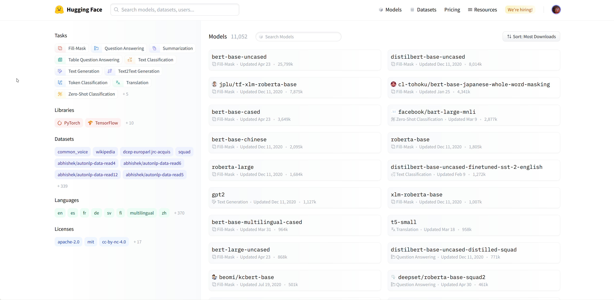
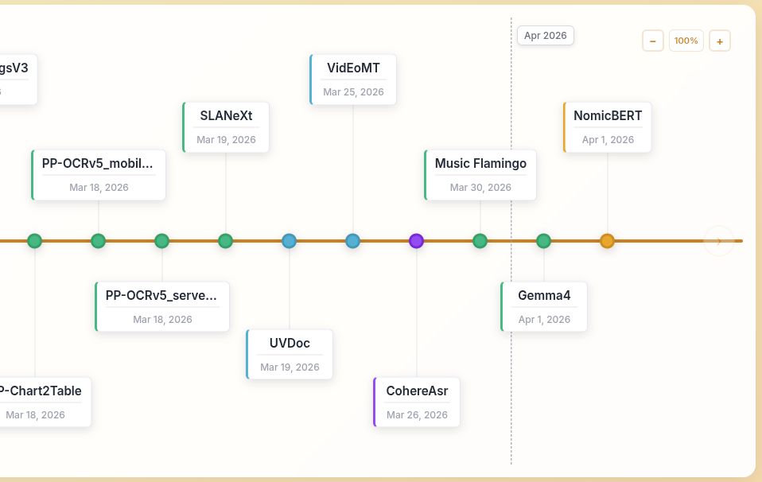
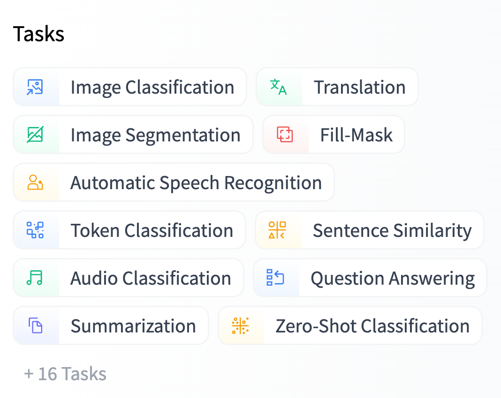

## Transformers Quick Tour

**Transformers** is a PyTorch-first library. It provides models that are faithful to their papers, easy to use, and easy to hack.

This library is for:

- Researchers and educators exploring or extending model architectures.
- Practitioners fine-tuning, evaluating, or serving models.
- Engineers who want a pretrained model that “just works” with a predictable API.

Go through the [Quick Tour](https://huggingface.co/docs/transformers/quicktour).


## What is the Hugging Face Hub?

* **Central Platform**: Discover, use, and contribute state-of-the-art models and datasets.
* **Scale**: Over 10,000 publicly available models.
* Not limited to 🤗 Transformers or NLP:
  * **NLP**: [Flair](https://github.com/flairNLP/flair), [AllenNLP](https://github.com/allenai/allennlp)
  * **Speech**: [Asteroid](https://github.com/asteroid-team/asteroid), [pyannote](https://github.com/pyannote/pyannote-audio)
  * **Vision**: [timm](https://github.com/rwightman/pytorch-image-models)


{fig-align="center" .r-stretch}


## Versioning & Accessibility

* **Git-Based**: Each model is a Git repository, ensuring versioning and reproducibility.
* **Community Focus**: Sharing eliminates the need for individual training and simplifies usage.
* **Accessibility**: Openly accessible to anyone looking to integrate SOTA technology.


## Hosted Inference API

* **Automatic Deployment**: Sharing a model automatically enables a hosted API.
* **Public Hub**: Sharing and using public models is completely **free**.
* **Private Options**: [Paid plans](https://huggingface.co/pricing) are available for users who wish to host models privately.


## Models Timeline

The [Models Timeline](https://huggingface.co/spaces/yonigozlan/Transformers-Timeline) is an interactive chart of how architectures in Transformers have changed over time. You can scroll through models in order, spanning text, vision, audio, video, and multimodal use cases.

Use the filters to narrow models by modality or task. Set custom date ranges to focus on models added during specific periods. Click a model card to see its capabilities, supported tasks, and documentation.

{fig-align="center" .r-stretch}


## Using pretrained models

[Tasks](https://huggingface.co/models), or pipeline types, describe the “shape” of each model’s API (inputs and outputs) and are used to determine which Inference API and widget we want to display for any given model.

We recommend using the task selector in the Hugging Face Hub interface in order to select the appropriate checkpoints:

{fig-align="center" .r-stretch}


## Transformers, what can they do?

Transformer models are used to solve all kinds of tasks across different modalities, including natural language processing (NLP), computer vision, audio processing, and more.

Notebook: [Transformers, what can they do? | LLM Course](https://huggingface.co/learn/llm-course/chapter1/3).


## Loading models

The [AutoModel](https://huggingface.co/docs/transformers/model_doc/auto) class is a convenient way to load an architecture without needing to know the exact model class name because there are many models available. It automatically selects the correct model class based on the configuration file. You only need to know the task and checkpoint you want to use.

Easily switch between models or tasks, as long as the architecture is supported for a given task.

## Same model, different tasks

For example, the same model can be used for separate tasks.

```py
from transformers import AutoModelForCausalLM, AutoModelForSequenceClassification, AutoModelForQuestionAnswering

# use the same API for 3 different tasks
model = AutoModelForCausalLM.from_pretrained("meta-llama/Llama-2-7b-hf")
model = AutoModelForSequenceClassification.from_pretrained("meta-llama/Llama-2-7b-hf")
model = AutoModelForQuestionAnswering.from_pretrained("meta-llama/Llama-2-7b-hf")
```

## Same task, different models

You may want to quickly try out several different models for a task.

```py
from transformers import AutoModelForCausalLM

# use the same API to load 3 different models
model = AutoModelForCausalLM.from_pretrained("meta-llama/Llama-2-7b-hf")
model = AutoModelForCausalLM.from_pretrained("mistralai/Mistral-7B-v0.1")
model = AutoModelForCausalLM.from_pretrained("google/gemma-7b")
```

## Caution: Large Models!

> Large pretrained models require a lot of memory to load. Transformers reduces some of these memory-related challenges with fast initialization, sharded checkpoints, Accelerate’s [Big Model Inference](https://hf.co/docs/accelerate/usage_guides/big_modeling) feature, and supporting lower bit data types.
