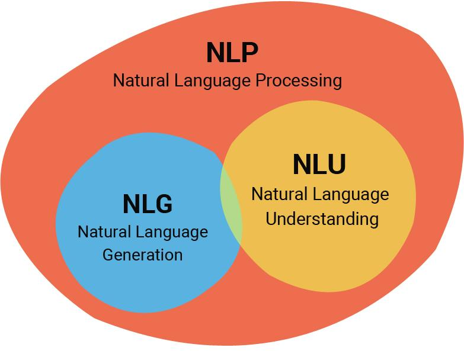
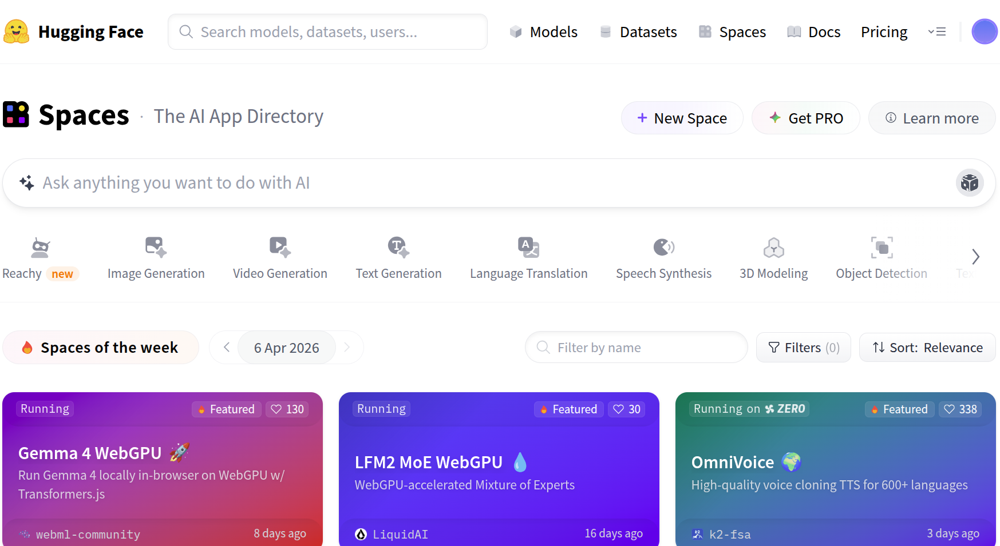

# Natural Language Processing (NLP)

NLP bridges the gap between computers and human language. It combines elements of:

1. computer science, 
2. linguistics, 
3. artificial intelligence

Recent success in NLP has been driven by **Deep Learning approach** which is based on [massive datasets](https://github.com/niderhoff/nlp-datasets) and models that can learn from data.
إليك الترجمة الدقيقة والموجزة للنص مع الحفاظ على كافة الأمثلة (الإنجليزية والعربية) كما طلبت:
# لماذا تعد معالجة اللغات صعبة {dir="rtl"}

## لماذا تعد معالجة اللغات صعبة {dir="rtl"}

ندرك المعنى والتشابه بديهياً؛ بينما تحتاج الحواسيب إلى تمثيلات رقمية مهيكلة. يجب على النماذج تحويل اللغة المعقدة والمرنة إلى متجهات رياضية.

تواجه معالجة اللغات الطبيعية الحديثة أربعة عوائق أساسية:

::: {.incremental}
* **الغموض** (معجمي، دلالي، تركيبي)
* **التجانس اللفظي**
* **التهكم والسخرية**
* **تعدد اللهجات**
* **العامية والمصطلحات الخاصة**
:::

## الغموض المعجمي (Lexical ambiguity) {dir="rtl"}

**الغموض المعجمي** هو نوع فرعي من الغموض الدلالي حيث تكون الكلمة أو المقطع الصرفي غامضاً.

::: {.incremental}
* "The fisherman went to the bank" (كلمة "bank" تعني ضفة النهر أو مبنى البنك).
* "شربت من العين" (نبع الماء).
* "أبصرت بـ العين" (عضو البصر).
* "أرسل القائد عيناً لاستطلاع العدو" (جاسوساً).
* "اشتريت هذا بعينه" (بذاته/نفسه).
:::

## الغموض الدلالي (Semantic ambiguity) {dir="rtl"}

ينتج **الغموض الدلالي** عن التعبيرات التي تحمل معاني متعددة.

::: {.incremental}
* "It’s on the house" (مجاني أو حرفياً فوق المنزل).
* "That went over my head" (عدم فهم أو مرور شيء فوق الرأس).
* "Not your business" (ليس من شأنك).
* "طارت الطيور بأرزاقها" (حرفياً: طارت بالطعام | مقصوداً: فات الأوان).
:::

## الغموض التركيبي (Syntactic Ambiguity) {dir="rtl"}

يحدث **الغموض التركيبي** عندما يكون للجملة شجرات إعرابية متعددة.

::: {.incremental}
* "I saw the man on the beach with my binoculars."
* التفسير 1: رأيت الرجل باستخدام منظاري.
* التفسير 2: الرجل كان يحمل منظاري معه.
:::

## التجانس اللفظي (Homonymy) {dir="rtl"}

يحدث **التجانس اللفظي** عندما تُنطق الكلمات بنفس الطريقة.

::: {.incremental}
* "This is a row of raw materials" (تشابه نطق row و raw).
* "I see the sea" (تشابه نطق see و sea).
* "Without my glasses I can't see the glass" (نظارة مقابل زجاج).
* "خاتم من ذَهَب" (المعدن).
* "ذَهَبَ محمد إلى المدرسة" (فعل المغادرة).
:::

## التهكم والسخرية (Irony and sarcasm) {dir="rtl"}

في أي وقت تقول فيه عكس الحقيقة عمداً، فهذا هو التهكم اللفظي.

::: {.incremental}
* "I love it when my computer crashes" (سخرية من تعطل الحاسوب).
* "Fantastic! I love waiting in line" (سخرية من الازدحام).
* "ما شاء الله، عبقري!" (تقال لمن يرتكب خطأ فادحاً).
* "جيتك يا عبد المعين تعين..." (تهكم لفظي).
* "طبيب يدخن السجائر" (مفارقة موقفية).
* "باب النجار مخلّع" (مفارقة موقفية).
:::

## اللهجات (Dialects) {dir="rtl"}

تختلف اللهجات في التهجئة، النطق، والمفردات حسب المناطق.

::: {.incremental}
* الفصحى: كيف حالك؟
* الخليجية: شلونك؟ / شعلومك؟
* المصرية: إزيك؟ / عامل إيه؟
* الشامية: كيفك؟
* المغربية: كيداير؟ / لباس؟
* النفي (المصرية/الشامية): ما اكلتش / ما اكلت.
* النفي (الخليجية): ما كليت / مو ماكل.
:::

## العامية والمصطلحات الخاصة (Slang and jargon) {dir="rtl"}

كلمات غير رسمية أو فنية تتطور باستمرار ويصعب على الآلات فهم سياقها.

::: {.incremental}
* "That movie was lit!" (الفيلم ممتاز).
* "I'm feeling blue" (أشعر بالحزن).
* "كبّر دماغك" (تجاهل الأمر).
* "سحَب عليه" (تجاهله/غاب عن الموعد).
* "قصف جبهته" (إحراج برد مفحم).
* ROI / KPI / ML (مصطلحات مهنية تخصصية).
:::

# Common Applications of NLP

## NLU & NLG

**Natural Language Understanding (NLU)**: extract meaning, intention, emotion, importance, and correlation between words/texts/speech.

- Examples: Classification, NER, and ASR

**Natural Language Generation (NLG)**: generate the most likely sequence given previous sequence.

- Examples: Question Answering, Summarization, Translation, and Coding.

{fig-align="center" .r-stretch}

## Machine Translation (MT)

Automatically converting text from one language into another. This is a challenging task because languages have different grammatical structures, vocabularies, and idioms.

- Translating **subtitles** for movies and TV shows
- Translating **posts** for marketing
- Translating **legal documents** for international business
- Translating **medical records** for healthcare providers

> Example: [NAMAA-T5-Saudi2English](https://huggingface.co/NAMAA-Space/NAMAA-MT-Saudi2English) fine-tuned on Saudi dialectal data (Najdi, Hijazi, Southern, Northern, and Eastern varieties) built on top of mBERT-initialized T5 architecture and aims to improve translation quality for informal and region-specific Arabic commonly used across Saudi Arabia.

## ASCAT: Arabic Scientific Corpus for Advanced Translation

[ASCAT-Arabic-Scientific-Translation](https://huggingface.co/datasets/NAMAA-Space/ASCAT-Arabic-Scientific-Translation).

- Domains: Physics, Mathematics, Computer Science, Quantum Mechanics, Artificial Intelligence
- Size: 500 full scientific abstracts
- Total English Tokens: 67,293
- Total Arabic Tokens: 60,026
- Arabic Vocabulary Size: 17,604 unique words

## Spelling Correction

[NAMAA-Space/SaudiSpell-AraT5](https://huggingface.co/NAMAA-Space/SaudiSpell-AraT5) Unlike generic Arabic correctors, this model is engineered to handle the specific orthographic and phonetic nuances of **Najdi**, **Hijazi**, and **Standard Saudi** dialects alongside Modern Standard Arabic (MSA). Trained on **3 Million sentences**.

- Najdi Example (Space Stripping)
  - Input: ياخي وراك مارديت
  - Expected: `يا  أخي  وراك  ما  رديت`

## Named-entity Recognition (NER)

**Named entity recognition (NER)** aims to extract entities in a piece of text into predefined categories such as: **personal names**, **organizations**, **locations**, and **quantities**.

{fig-align="center" .r-stretch}

Example: [GLiNER](https://huggingface.co/NAMAA-Space/gliner_arabic-v2.1).

Applications:

- Building knowledge graphs for Arabic content.
- Enhancing search and recommendation systems with entity-aware features.

## Information Retrieval (IR)

**Information Retrieval (IR)** is the process of finding relevant information from a collection of documents.

- **Search engines** crawl, index, and find documents based on user queries.
- **Chat models** uses Retriveal to Augment their Generation (RAG) to provide up-to-date and factual answers.

See: [`intfloat` (Liang Wang)'s collections](https://huggingface.co/intfloat) for **embedding** and **reranker** models.

## Text Classification

**Text Classification** is the process of assigning a category or label to a piece of text.

**Spam Detection** (Spam / Not Spam) in emails and messages:

> "Congratulations! You've won a $1000 Walmart gift card. Click here to claim your prize."

**Sentiment Analysis** identifies the emotional tone of text.

* **Positive:** "This coffee is amazing!"
* **Negative:** "My order arrived cold and late."
* **Neutral:** "The store opens at 8 AM."

**Content Moderation** essential part of any online community.

- **Fake reviews** (تقييمات مزيفة)
- **Fake news** (أخبار مزيفة)
- **Fake accounts** (حسابات مزيفة)
- **Inappropriate content** (محتوى غير لائق)

## Optical Character Recognition (OCR)

Optical Character Recognition (OCR) converts images of text into searchable, editable data. Here is where it is used most effectively:

1. **Traffic:** Reading license plates for automated toll collection and parking garage access.
2. **Digitalization:**
    - Converting physical books, legal files, and historical archives into searchable digital databases.
    - Instantly extracting text from invoices, receipts, and tax forms to eliminate manual typing.
3. **Live Translation:** Enabling apps to translate foreign street signs or menus by simply pointing a smartphone camera at them.

Example: [QARI-OCR](https://huggingface.co/NAMAA-Space/Qari-OCR-v0.3-VL-2B-Instruct) Structural Arabic Document Understanding.

## Automatic Speech Recognition (ASR)

Convert spoken language into text or actionable commands.

- **Transcription:**
  - **phone calls** for customer service and sales
  - **meetings** for note-taking and documentation
  - **lectures** for students and researchers
  - **podcasts** for SEO and accessibility
  - **interviews** for journalists and researchers
- **Dictation:** for people to speak their notes directly into text documents.
- **Voice Assistants:** Powering smart devices (like Siri or Google Assistant) to answer questions, set reminders, and control smart homes.

> Example: [NAMAA-Space/EgypTalk-ASR-v2](https://huggingface.co/NAMAA-Space/EgypTalk-ASR-v2) trained on over 200 hours of high-quality, manually curated audio data collected and prepared by the NAMAA team. It is built upon NVIDIA’s FastConformer Hybrid Large architecture and fine-tuned for Egyptian Arabic, enabling highly accurate transcription in casual, formal, and mixed dialect settings.

## Text to Speech (TTS)

Convert text into speech.

> Example: [NAMAA-Saudi-TTS](https://huggingface.co/spaces/omarelshehy/NAMAA-Saudi-Voice) refined to generate natural Saudi dialect speech, targeting everyday conversational usage rather than Modern Standard Arabic (MSA).

## What is the Hugging Face Hub?

* **Central Platform**: Discover, use, and contribute state-of-the-art models and datasets.
* **Scale**: Over 10,000 publicly available models.
* Not limited to 🤗 Transformers or NLP:
  * **NLP**: [Flair](https://github.com/flairNLP/flair), [AllenNLP](https://github.com/allenai/allennlp)
  * **Speech**: [Asteroid](https://github.com/asteroid-team/asteroid), [pyannote](https://github.com/pyannote/pyannote-audio)
  * **Vision**: [timm](https://github.com/rwightman/pytorch-image-models)

{fig-align="center" .r-stretch}

## Versioning & Accessibility

* **Git-Based**: Each model is a Git repository, ensuring versioning and reproducibility.
* **Community Focus**: Sharing eliminates the need for individual training and simplifies usage.
* **Accessibility**: Openly accessible to anyone looking to integrate SOTA technology.

## Open-source models on HuggingFace

[Tasks](https://huggingface.co/models), or pipeline types, describe the “shape” of each model’s API (inputs and outputs) and are used to determine which Inference API and widget we want to display for any given model.

We recommend using the task selector in the Hugging Face Hub interface in order to select the appropriate checkpoints:

{fig-align="center" .r-stretch}

## Find the latest models

The [Models Timeline](https://huggingface.co/spaces/yonigozlan/Transformers-Timeline) is an interactive chart of how architectures in Transformers have changed over time. You can scroll through models in order, spanning text, vision, audio, video, and multimodal use cases.

Use the filters to narrow models by modality or task. Set custom date ranges to focus on models added during specific periods. Click a model card to see its capabilities, supported tasks, and documentation.

{fig-align="center" .r-stretch}

## Hosted Inference API

* **Automatic Deployment**: Sharing a model automatically enables a hosted API.
* **Public Hub**: Sharing and using public models is completely **free**.
* **Private Options**: [Paid plans](https://huggingface.co/pricing) are available for users who wish to host models privately.

{fig-align="center" .r-stretch}

## Transformers Quick Tour

The 🤗 **Transformers** library is a PyTorch-first library. It provides models that are faithful to their papers, easy to use, and easy to hack.

- Engineers who want a pretrained model that “just works” with a predictable API.
- Practitioners fine-tuning, evaluating, or serving models.
- Researchers and educators exploring or extending model architectures.

[This quickstart](https://huggingface.co/docs/transformers/quicktour) introduces you to Transformers’ key features and shows you how to:

1. Load a pretrained model
2. Run inference with `Pipeline`
3. Fine-tune a model with `Trainer`
