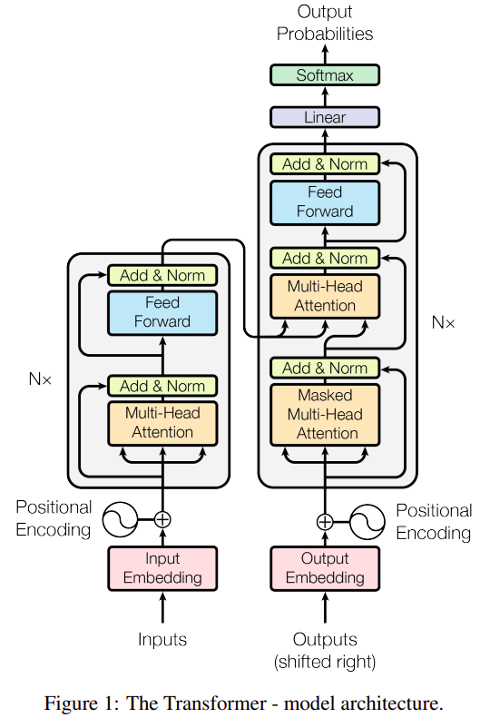
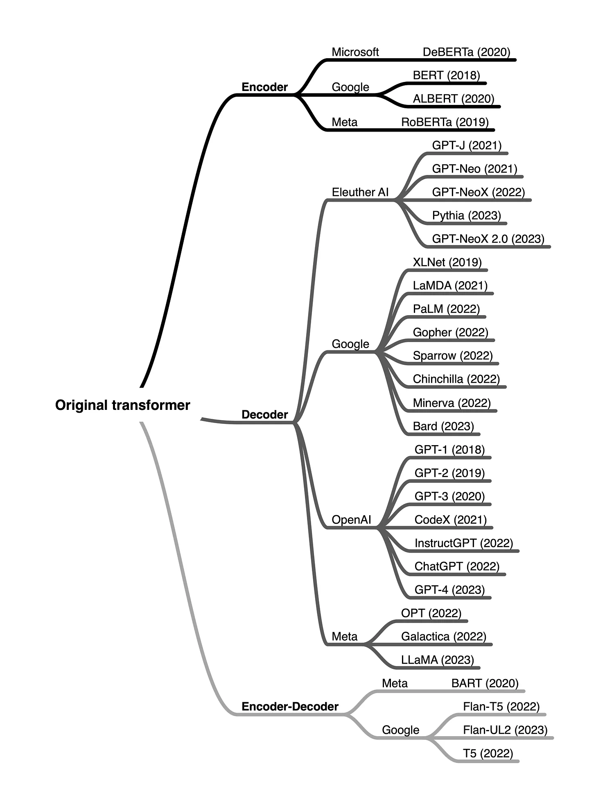
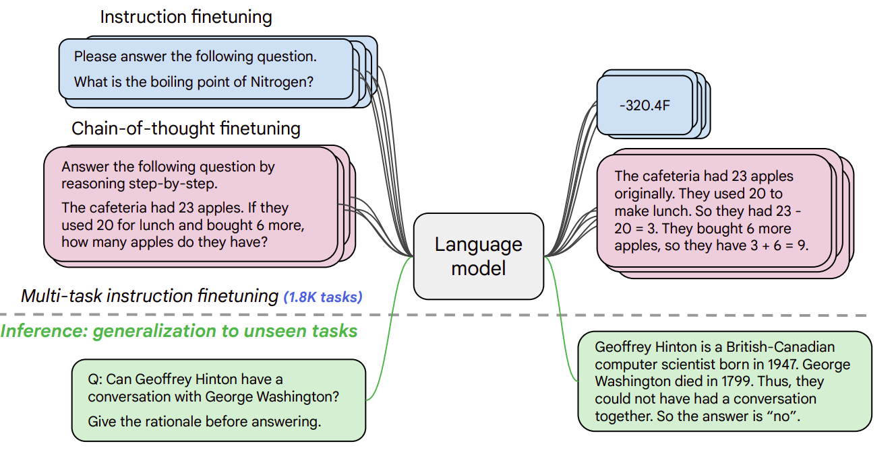
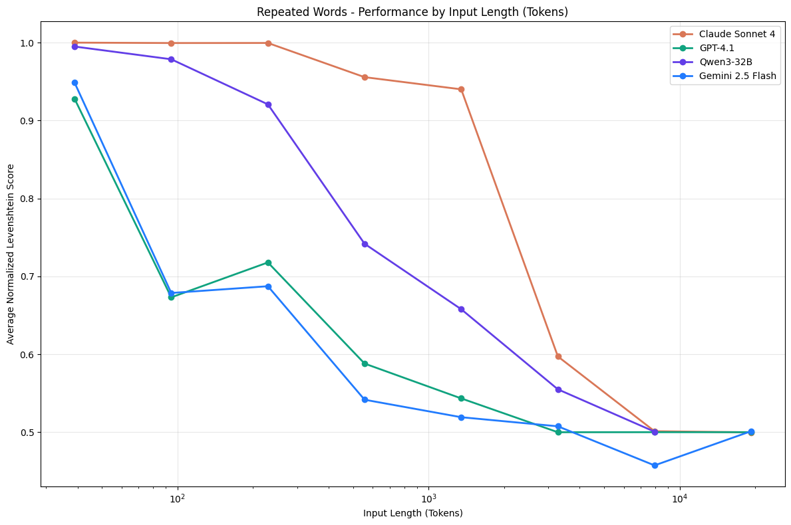
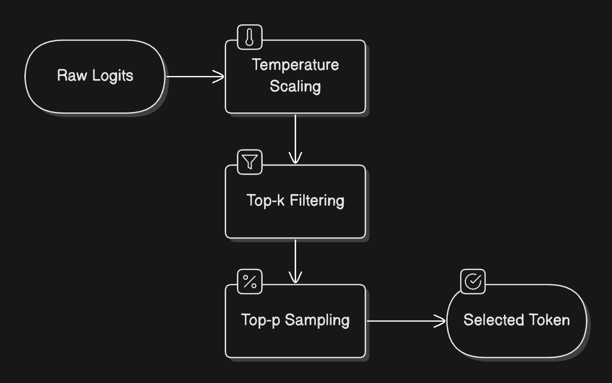
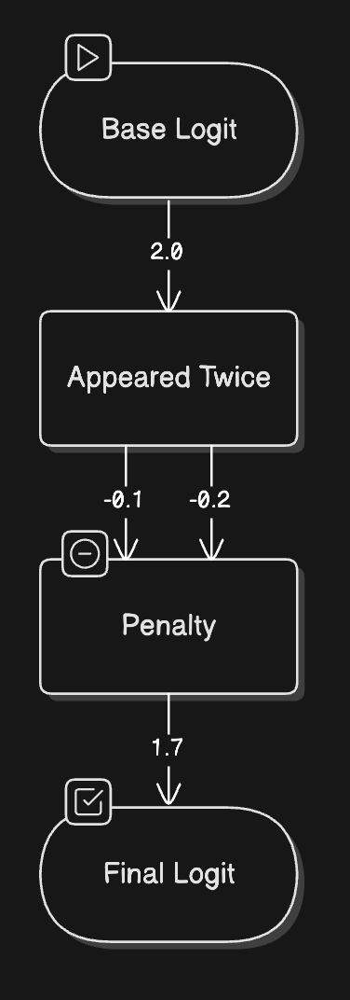

# Large Language Models (LLMs)

**Large Language Models (LLMs)** are a powerful subset of deep neural NLP models characterized by:

1. massive size (billions of parameters)
2. extensive training data (trillions of tokens)
3. ability to perform a wide range of language tasks

## Original 2017 Transformer

::: {.columns}
::: {.column}
- The **encoder** (left) maps an input sequence of symbol representations (tokens) to a sequence of continuous representations (vectors).
- The **decoder** (right) then generates an output sequence of symbols (tokens) one element at a time.
- At each step the model is auto-regressive, consuming the previously generated symbols as additional input when generating the next.

-- [Attention is All You Need (Vaswani et al.)](https://arxiv.org/abs/1706.03762)

:::
::: {.column}
{.r-stretch}
:::
:::
<!-- end columns -->

## Variants of the Transformer

{fig-align="center" .r-stretch}

## Comparison Table

Understanding these differences will help you choose the right model for your specific task.

| Architecture    | Attention Style                            | Prediction Goal                                      | Typical Use Cases                   | Popular Models                       |
| --------------- | ------------------------------------------ | ---------------------------------------------------- | ----------------------------------- | ------------------------------------ |
| Encoder–decoder (2017 Original) | Bidirectional (encoder) + causal (decoder) | Conditional generation (output sequence given input) | Translation, summarization, seq2seq | [BART](https://huggingface.co/docs/transformers/model_doc/bart) - [mBART](https://huggingface.co/docs/transformers/model_doc/mbart) - [Marian](https://huggingface.co/docs/transformers/model_doc/marian) - [T5](https://huggingface.co/docs/transformers/model_doc/t5)                   |
| Decoder-only (2018 GPT-1)    | Causal (masked)                            | Next-token probability distribution                  | Autoregressive text generation      | [Hugging Face SmolLM Series](https://huggingface.co/HuggingFaceTB/SmolLM2-1.7B-Instruct) - [Meta's Llama Series](https://huggingface.co/docs/transformers/en/model_doc/llama4) - [Google's Gemma Series](https://huggingface.co/docs/transformers/main/en/model_doc/gemma3) - [DeepSeek's V3](https://huggingface.co/deepseek-ai/DeepSeek-V3) |
| Encoder-only (2018 BERT)    | Bidirectional                              | Contextual embeddings, not next-token prediction     | Classification, retrieval, NER      | [BERT](https://huggingface.co/docs/transformers/model_doc/bert) - [DistilBERT](https://huggingface.co/docs/transformers/model_doc/distilbert) - [ModernBERT](https://huggingface.co/docs/transformers/en/model_doc/modernbert)                        |

## Modern Large Language Models (LLMs)

Most LLMs today are **Decoder-only** with billions of parameters. Trained in two phases:

1. **Pretraining**: The model learns to predict the next token on vast amounts of text data
2. **Instruction tuning**: The model is fine-tuned to follow instructions and generate helpful responses

This approach has led to models that can understand and generate human-like text across a wide range of topics and tasks.

### Supervised Learning

Training task is to mimic the human-curated: `(prompt, output)` text sequences.

[FLAN T5 | Google](https://arxiv.org/abs/2210.11416): "We finetune various language models on 1.8K tasks phrased as instructions, and evaluate them on unseen tasks":

::: {.columns}
::: {.column}
- Answer general knowledge questions:
    - `Prompt: "What is the tallest building?" , Output: "The tallest building is ..."`
- Translate from English to French:
    - `Prompt: "Translate this paragraph ..." , Output: "Bonjour lemuv beleluo"`
- Write code:
    - `Prompt: "Write Python function to analyse ..." , Output: "def analyze(...)`

:::
::: {.column}
{fig-align="center"}
:::
:::
<!-- end columns -->

## Key capabilities of modern LLMs

Modern decoder-based LLMs have demonstrated impressive capabilities:

| Capability | Description | Example |
|------------|-------------|---------|
| Text generation | Creating coherent and contextually relevant text | Writing essays, stories, or emails |
| Summarization | Condensing long documents into shorter versions | Creating executive summaries of reports |
| Translation | Converting text between languages | Translating English to Spanish |
| Question answering | Providing answers to factual questions | "What is the capital of France?" |
| Code generation | Writing or completing code snippets | Creating a function based on a description |
| Reasoning | Working through problems step by step | Solving math problems or logical puzzles |
| Few-shot learning | Learning from a few examples in the prompt | Classifying text after seeing just 2-3 examples |

You can experiment with decoder-based LLMs directly in your browser via model repo pages on the Hub. Here's an example with the classic [GPT-2](https://huggingface.co/openai-community/gpt2) (OpenAI's finest open source model).

## Practical applications of Encoder-decoder models

Sequence-to-sequence models excel at tasks that require transforming one form of text into another while preserving meaning.

| Application | Description | Example Model |
|-------------|-------------|---------------|
| Machine translation | Converting text between languages | Marian, T5 |
| Text summarization | Creating concise summaries of longer texts | BART, T5 |
| Data-to-text generation | Converting structured data into natural language | T5 |
| Grammar correction | Fixing grammatical errors in text | T5 |
| Question answering | Generating answers based on context | BART, T5 |

## Interactive demo: speech-to-speech translation

[Here's an interactive demo](https://course-demos-speech-to-speech-translation.hf.space) of a sequence-to-sequence model for translation:

<center>
<iframe
	src="https://course-demos-speech-to-speech-translation.hf.space"
	frameborder="0"
	width="960"
	height="680"
></iframe>
</center>

## Choosing the right architecture

When working on a specific NLP task, how do you decide which architecture to use? Here's a quick guide:

::: {.columns}
::: {.column}
* **Text Classification** (Sentiment, Topic)
    * Architecture: Encoder
    * Examples: BERT, RoBERTa
* **Text Generation** (Creative Writing)
    * Architecture: Decoder
    * Examples: GPT, LLaMA
* **Translation**
    * Architecture: Encoder-Decoder
    * Examples: T5, BART
* **Summarization**
    * Architecture: Encoder-Decoder
    * Examples: BART, T5
:::
::: {.column}
* **Named Entity Recognition**
    * Architecture: Encoder
    * Examples: BERT, RoBERTa
* **Question Answering** (Extractive)
    * Architecture: Encoder
    * Examples: BERT, RoBERTa
* **Question Answering** (Generative)
    * Architecture: Encoder-Decoder or Decoder
    * Examples: T5, GPT
* **Conversational AI**
    * Architecture: Decoder
    * Examples: GPT, LLaMA
:::
:::
<!-- end columns -->

## LLM Pipelines

### Same model, different tasks {.smaller}

```py
from transformers import pipeline

# use the same API for 3 different tasks
checkpoint = "meta-llama/Llama-2-7b-hf"

answerer = pipeline("question-answering", model=checkpoint)
classifier = pipeline("sentiment-analysis", model=checkpoint)
generator = pipeline("text-generation", model=checkpoint)
```

### Same task, different models {.smaller}

```py
from transformers import pipeline

# Task remains "text-generation", models change
llama = pipeline("text-generation", model="meta-llama/Llama-2-7b-hf")
mistral = pipeline("text-generation", model="mistralai/Mistral-7B-v0.1")
gemma = pipeline("text-generation", model="google/gemma-7b")
```

# Inference for Large Models

- We use both Half-precision and Quantization to reduce memory requirement.
- We also need to use a GPU `device="auto"`

Install:

```sh
pip install -U bitsandbytes
```

Load LLM fot `text-generation` task via pipeline:

```py
pipe = pipeline(
    "text-generation",
    model="mistralai/Mistral-7B-v0.1",        
    dtype=torch.bfloat16,    # Half-precision (reduce memory)
    device_map="auto",       # Automatic Resource Allocation
    model_kwargs={
        # 8-bit Quantization (compress model)
        "quantization_config": BitsAndBytesConfig(load_in_8bit=True)
    },
)
```

## Common `generate()` Options

LLMs are trained to generate the next `token` given some initial `prompt`, repeatedly along with its own generated `outputs`.

The [generate()](https://huggingface.co/docs/transformers/v5.5.0/en/main_classes/text_generation#transformers.GenerationMixin.generate) method (equivalent to using `__call__` directly) is a powerful tool that can be heavily customized:

|Option name|Type|Simplified description|
|---|---|---|
|`max_new_tokens`|`int`|Controls the maximum generation length. Be sure to define it, as it usually defaults to a small value.|
|`do_sample`|`bool`|Defines whether generation will sample the next token (`True`), or is greedy instead (`False`). Most use cases should set this flag to `True`. Check [this guide](https://huggingface.co/docs/transformers/v5.5.0/en/generation_strategies) for more information.|
|`temperature`|`float`|How unpredictable the next selected token will be. High values (`>0.8`) are good for creative tasks, low values (e.g. `<0.4`) for tasks that require “thinking”. Requires `do_sample=True`.|
|`num_beams`|`int`|When set to `>1`, activates the beam search algorithm. Beam search is good on input-grounded tasks. Check [this guide](https://huggingface.co/docs/transformers/v5.5.0/en/generation_strategies) for more information.|
|`repetition_penalty`|`float`|Set it to `>1.0` if you’re seeing the model repeat itself often. Larger values apply a larger penalty.|
|`eos_token_id`|`list[int]`|The token(s) that will cause generation to stop. The default value is usually good, but you can specify a different token.|

See: [Common Options](https://huggingface.co/docs/transformers/v5.5.0/en/llm_tutorial#common-options).

## Pitfalls

Common issues when using [generate()](https://www.google.com/search?q=/docs/transformers/v5.5.0/en/main_classes/text_generation%23transformers.GenerationMixin.generate) via the `pipeline` API.

1. Output length
2. Decoding strategy
3. Padding side
4. Prompt format

## Issue 1: Output length

Pipelines return 20 tokens by default unless defined otherwise in a model's [GenerationConfig](https://www.google.com/search?q=/docs/transformers/v5.5.0/en/main_classes/text_generation%23transformers.GenerationConfig). Manually set `max_new_tokens` to control length. [Decoder-only](https://hf.co/learn/nlp-course/chapter1/6?fw=pt) models return the prompt and generated tokens by default.

```python
# Default: ~20 tokens
pipe("A sequence of numbers: 1, 2")

# Explicit: 50 new tokens
pipe("A sequence of numbers: 1, 2", max_new_tokens=50)
```

## Issue 2: Decoding strategy

The default strategy is *greedy search*. For creative tasks, use [multinomial sampling](https://www.google.com/search?q=./generation_strategies%23multinomial-sampling) by setting `do_sample=True`.

```python
# Greedy search
pipe("I am a cat.")

# Multinomial sampling
pipe("I am a cat.", do_sample=True)
```

## Issue 3: Padding side

LLMs require `padding_side="left"` to continue generation correctly from padded batches.

```python
from transformers import AutoTokenizer

tokenizer = AutoTokenizer.from_pretrained("mistralai/Mistral-7B-v0.1", padding_side="left")
tokenizer.pad_token = tokenizer.eos_token

pipe = pipeline("text-generation", model="mistralai/Mistral-7B-v0.1", tokenizer=tokenizer)

pipe([
  "1, 2, 3",      # input 1
  "A, B, C, D, E" # input 2
], padding=True)
```

## Issue 4: Prompt format

Models often require specific formats. Check the [prompt engineering](https://www.google.com/search?q=./tasks/prompting) guide for details. Chat models use a [chat template](https://www.google.com/search?q=./chat_templating) structure; passing a list of dictionaries to a pipeline handles this automatically.

```python
messages = [
    {"role": "system", "content": "You are a pirate."},
    {"role": "user", "content": "How many cats does it take to change a light bulb?"},
]

# Pipeline automatically applies the chat template
pipe(messages, max_new_tokens=50)
```

## How LLMs actually generate text?

- Understanding the mechanism gives us control over it
- Having control means we can optimize to our own metrics

Generation of text in LLMs works in two phases:

1. **Prefill**
   1. Tokenization
   2. Embedding
   3. Processing
2. **Decode**
   1. Attention
   2. Probability
   3. Selection
   4. Check

## Phase 1: Prefill

Like reading the entire text word-for-word each time, before starting to write the next word. It involves:

1. **Tokenization**: identify input as segmented parts.
2. **Embedding**: map to corrresponding vectors.
3. **Processing**: run the vectors through the neural network. 

## The Tokenizer Playground

You can [experiment with different tokenizers](https://agents-course-the-tokenizer-playground.static.hf.space) (first step in this phase) in the interactive playground below:

<center>
<iframe
	src="https://agents-course-the-tokenizer-playground.static.hf.space"
	frameborder="0"
	width="850"
	height="450"
></iframe>
</center>


## The Role of Attention

When predicting the next word, not every word in a sentence carries equal weight - for example, in the sentence *"The capital of France is ..."*, the words "France" and "capital" are crucial for determining that "Paris" should come next. This ability to focus on relevant information is what we call attention.

{fig-align="center"}

This involves many computationally intensive operations.

## Context Length

- The model should handle the 10,000th token just as reliably as the 100th.
- However, in practice, this assumption does not hold. We observe that model performance varies significantly as input length changes, even on simple tasks.

{fig-align="center" .r-stretch}

Figure shows 18 LLMs, including the state-of-the-art GPT-4.1, Claude 4, Gemini 2.5, and Qwen3 models. Our results reveal that models do not use their context uniformly; instead, their performance grows increasingly unreliable as input length grows. -- ([July 14, 2025 Context Rot | Chroma](https://www.trychroma.com/research/context-rot))

## Phase 2: Decode

- The model generates one token.
- It is sampled from a probability distribution over all token in the vocabulary.
- That token may be: a space, a comma, a digit, a character, a word, or a subword.
- It could be a special token **EOS** (end of sequence) to stop generation.

## Sampling Strategies

You can [interact with the basic decoding process](https://agents-course-decoding-visualizer.hf.space) yourself with SmolLM2 in this Space (remember, it decodes until reaching an **EOS** token which is  **<|im_end|>** for this model):

<center>
<iframe
	src="https://agents-course-decoding-visualizer.hf.space"
	frameborder="0"
	width="850"
	height="450"
></iframe>
</center>

## Token Selection

::: {.columns}
::: {.column}
1. **Logits**: unprocessed probability distribution over all tokens in the vocabulary
2. **Temperature Scaling**:
    - higher settings (>1.0) make choices more random and creative
    - lower settings (<1.0) make them more focused and deterministic
3. **Top-p (Nucleus) Sampling**: Instead of considering all possible words, we only look at the most likely ones that add up to our chosen probability threshold (e.g., top 90%)
4. **Top-k Filtering**: An alternative approach where we only consider the `k` most likely next words

:::
::: {.column}
{fig-align="center"}

:::
:::
<!-- end columns -->

## Managing Repetition

::: {.columns}
::: {.column}
One common challenge with LLMs is their tendency to repeat themselves. To address this, we use two types of penalties:

1. **Presence Penalty**: A fixed penalty applied to any token that has appeared before, regardless of how often. This helps prevent the model from reusing the same words.
2. **Frequency Penalty**: A scaling penalty that increases based on how often a token has been used. The more a word appears, the less likely it is to be chosen again.

These penalties are applied early in the token selection process, adjusting the raw probabilities before other sampling strategies are applied. Think of them as gentle nudges encouraging the model to explore new vocabulary.
:::
::: {.column}
{fig-align="center"}
:::
:::
<!-- end columns -->

## Beam Search

**Beam Search explores multiple possible paths simultaneously**. Then select the sequence with the highest overall probability.

You can [explore beam search visually here](https://agents-course-beam-search-visualizer.hf.space):

<center>
<iframe
	src="https://agents-course-beam-search-visualizer.hf.space"
	frameborder="0"
	width="850"
	height="450"
></iframe>
</center>

This approach often produces more coherent and grammatically correct text, though it requires more computational resources than simpler methods.

## Custom generation

Custom generation methods enable specialized behavior such as:

1. have the model continue thinking if it is uncertain;
2. roll back generation if the model gets stuck;
3. handle special tokens with custom logic;
4. use specialized KV caches;

See: [Finding custom generation methods](https://huggingface.co/docs/transformers/generation_strategies#finding-custom-generation-methods).


## Resources

* [Optimum](https://github.com/huggingface/optimum): Hardware-specific optimization.
* [Outlines](https://github.com/dottxt-ai/outlines): Constrained (JSON) generation.
* [SynCode](https://github.com/uiuc-focal-lab/syncode): Grammar-guided generation.
* [Text Generation Inference](https://github.com/huggingface/text-generation-inference): Production server.
* [Text generation web UI](https://github.com/oobabooga/text-generation-webui): Gradio interface.
* [logits-processor-zoo](https://github.com/NVIDIA/logits-processor-zoo): Advanced generation control.
