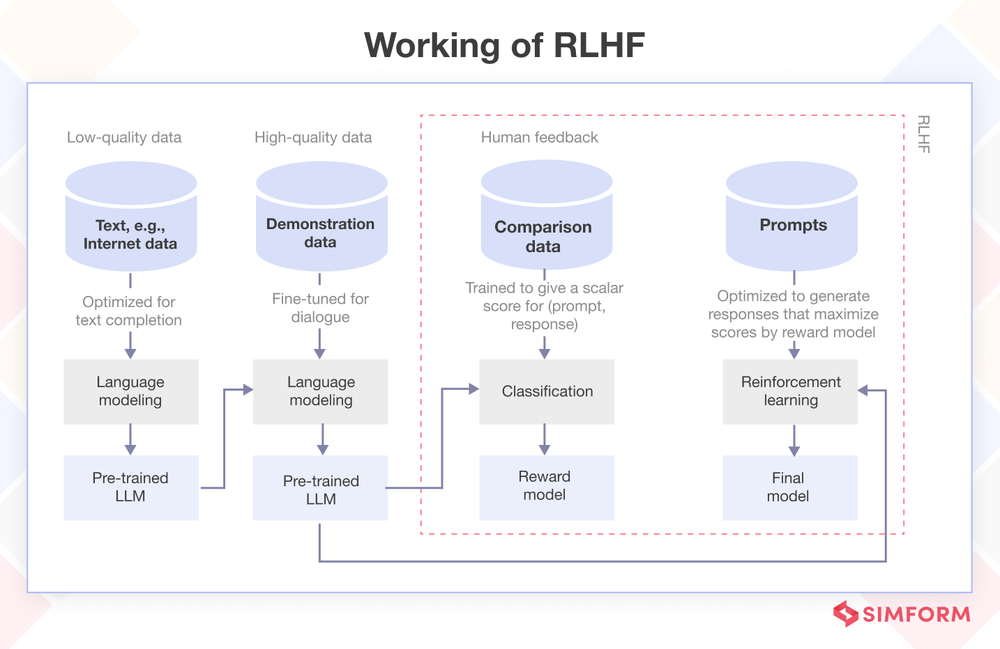
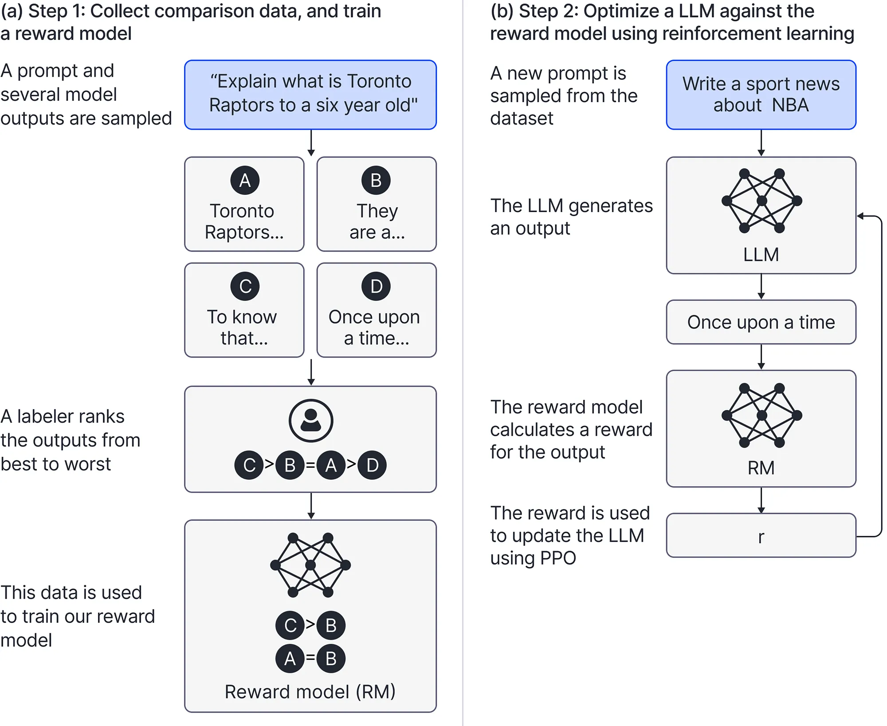

## How LLMs are Trained?

Three stages of training:

1. Pretraining (Unsupervised)
2. Supervised Fine-tuning (SFT)
3. Reinforcement Learning from Human Feedback (RLHF)

This is the standard pipeline for building a modern Large Language Model (LLM).

## Three stages of LLM training

{fig-align="center" .r-stretch}

## 1. Pretraining (The Knowledge Base)

* **Goal:** Learn language, facts, and reasoning from the internet.
* **Method:** **Unsupervised Learning**. The model predicts the next word in a sequence (Self-Supervised).
* **Scale:** Massive datasets (trillions of tokens) and high compute.
* **Outcome:** A "Base Model" that is a world-class autocompleter but bad at following instructions.

## 2. Supervised Fine-tuning / SFT (The Assistant)

* **Goal:** Teach the model how to act like an assistant and follow specific formats.
* **Method:** **Supervised Learning**. Humans write high-quality "Prompt-Response" pairs.
* **Scale:** Small, curated datasets (thousands to tens of thousands of examples).
* **Outcome:** An "Instruct Model" that understands commands but may still produce "hallucinations" or unsafe content.

## 3. Reinforcement Learning from Human Feedback / RLHF (The Polishing)

* **Goal:** Align the model with human values (helpfulness, honesty, safety).
* **Method:**
    1.  **Preference Labeling:** Humans rank multiple model outputs from best to worst.
    2.  **Reward Modeling:** A separate model learns these preferences.
    3.  **Optimization:** The LLM is updated (often via PPO or DPO) to maximize the "reward" score.
* **Outcome:** A "Chat Model".

## RLHF

{fig-align="center" .r-stretch}

## Transfer Learning

**Transfer learning** is reusing a trained model on a new, related problem. Advantages are:

- **Time**: Training takes days instead of months.
- **Data**: You only need thousands of specialized examples instead of trillions of general ones.
- **Cost**: Less time spent on training on less data means less compute and thus less cost.

## Example: QARI-OCR

[QARI-OCR](https://huggingface.co/NAMAA-Space/Qari-OCR-v0.3-VL-2B-Instruct) is a **Vision-language Model (VLM)** fine-tuned from `Qwen2-VL-2B-Instruct` to process Arabic documents. Key Features:

- 📐 **Layout-Aware Recognition**: Preserves document structure with HTML/Markdown tags
- 🔤 **Full Diacritics Support**: Accurate recognition of tashkeel (Arabic diacritical marks)
- 📝 **Multi-Font Handling**: Trained on 12 diverse Arabic fonts (14px-100px)
- 🎯 **Structure-First Design**: Optimized for documents with headers, body text, and complex layouts
- ⚡ **Efficient Training**: Only 11 hours on single GPU with 10k samples
- 🖼️ **Robust Performance**: Handles low-resolution and degraded images

## QARI-OCR Model Performance

| Metric                         | Score       |
| ------------------------------ | ----------- |
| **Character Error Rate (CER)** | 0.300       |
| **Word Error Rate (WER)**      | 0.485       |
| **BLEU Score**                 | 0.545       |
| **Training Time**              | 11 hours    |
| **CO₂ Emissions**              | 1.88 kg eq. |

## QARI-OCR Training Details

- **Base Model**: Qwen2-VL-2B-Instruct
- **Training Data**: 10,000 synthetic Arabic documents with HTML markup
- **Optimization**: 4-bit LoRA adapters (rank=16)
- **Hardware**: Single NVIDIA A6000 GPU (48GB)
- **Framework**: Unsloth + Hugging Face TRL

# How to train?

1. Transformers
2. Unsloth

## HunggingFace Transformers Task Recipes

::: {.columns}
::: {.column}
{.r-stretch}
:::
::: {.column}
[Example: ASR](https://huggingface.co/docs/transformers/tasks/asr).
:::
:::
<!-- end columns -->

## Unsloth Studio (beta)

{fig-align="center" .r-stretch}

## Unsloth

**Unsloth** is an open-source framework for running and training models.

[⭐ Fine-tuning for Beginners](https://unsloth.ai/docs/get-started/fine-tuning-for-beginners):

::: {.columns}
::: {.column}
* [Fine-tuning Guide](https://unsloth.ai/docs/get-started/fine-tuning-llms-guide)
    * Step-by-step on how to fine-tune!
    * Learn the core basics of training.
* [What model should I use?](https://unsloth.ai/docs/get-started/fine-tuning-llms-guide/what-model-should-i-use)
    * Instruct or Base Model?
    * How big should my dataset be?
* [Is Fine-tuning right for me?](https://unsloth.ai/docs/get-started/fine-tuning-for-beginners/faq-+-is-fine-tuning-right-for-me)
    * What can fine-tuning do for me?
    * RAG vs. Fine-tuning?
:::
::: {.column}
* [Datasets Guide](https://unsloth.ai/docs/get-started/fine-tuning-llms-guide/datasets-guide)
    * How do I structure/prepare my dataset?
    * How do I collect data?
* [Inference & Deployment](https://unsloth.ai/docs/basics/inference-and-deployment)
    * How do I save my model locally?
    * How do I run my model via Ollama or vLLM?
* [Unsloth Requirements](https://unsloth.ai/docs/get-started/fine-tuning-for-beginners/unsloth-requirements)
    * Does Unsloth work on my GPU?
    * How much VRAM will I need?
:::
:::
<!-- end columns -->

